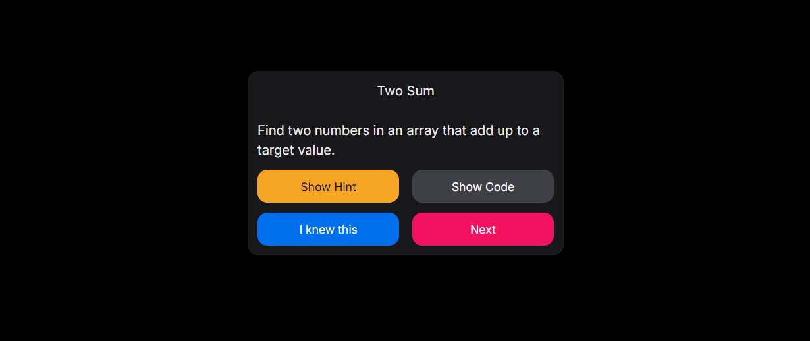

# Interview Preparation Flashcards

This is a web app I made in 2 hours.
It is a Interview Preperation tool made using Next.js (React) + NextUI + Tailwind + Node.js

To launch the app, navigate to frontend and backend folders and run:
```bash
npm install
```

Afterwards, In /frontend, run:
```bash
npm run dev
```

Then, In /backend, run:
```bash
npm run start
```

You can view the web app in your browser at: http://localhost:3000/


